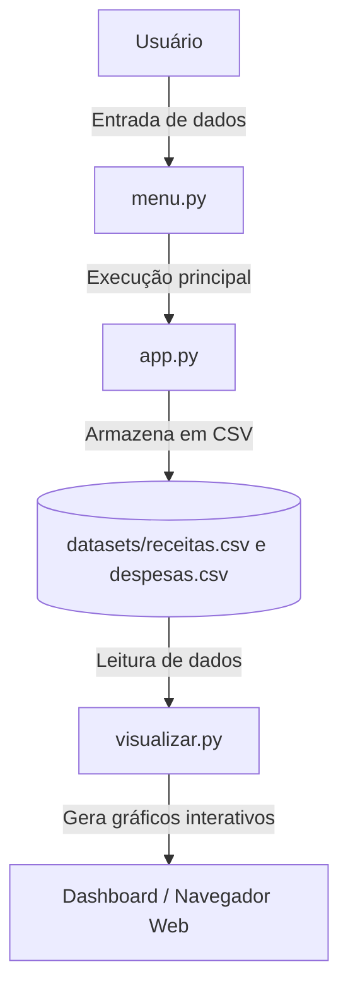

#  Personal Organizer Financeiro

**Disciplina:** Programação para Ciência de Dados  
**Curso:** MBA Ciência de Dados - UNIFOR  
**Instrutor:** Cássio Pinheiro  
**Integrantes:**  
- Leonardo Deodato Matrícula: 2528090

**Repositório GitHub:** [https://github.com/leonardodeodato/personal-organizer-financeiro]
**Data de Entrega:** 14/11/2025  

### Objetivo do Projeto

O **Personal Organizer Financeiro** tem como objetivo auxiliar o usuário no **controle de receitas e despesas pessoais**, permitindo o registro, consulta e visualização de dados financeiros de forma simples e intuitiva.

### Problema a ser resolvido
Muitos usuários têm dificuldade em acompanhar seus gastos e planejar finanças mensais. Este sistema oferece uma **forma automatizada e visual de controle**, armazenando os dados de forma permanente e apresentando gráficos interativos.

### Público-alvo
Pessoa física e autônomos que desejam **gerenciar finanças pessoais ou de prestação de serviços/vendas** sem necessidade de planilhas complexas ou softwares pagos.

### Contexto de aplicação
Aplicação desenvolvida em **Python**, com uso das bibliotecas **pandas** (para manipulação de dados) e **plotly dash** (para visualização interativa), visando integração prática entre fundamentos de programação e análise de dados.

---

## 3. Diagrama

**Descrição:**
- O **usuário** interage via terminal, registrando receitas e despesas.  
- O módulo **`dataset.py`** salva e gerencia esses registros em arquivos CSV.  
- O módulo **`visualizar.py`** lê os dados e cria gráficos interativos de evolução financeira.  

---

### 4. Funcionalidades Implementadas

 **Registrar Receita** - Permite inserir uma nova receita (descrição, valor e data) - `dataset.py` 
 **Registrar Despesa** - Permite registrar uma despesa no sistema `dataset.py`
 **Calcular Saldo** - Calcula o saldo total com base nas receitas e despesas armazenadas  `dataset.py`
 **Relatório** - Permite a visualização das entradas e saídas de forma rápida. `dataset.py`
 **Casdatrar_categoria** - Permite cadastrar um categoria de despeas ou receita `dataset.py`
**Excluir_registro** - Permite excluir um registro dos arquivos de receitas ou despeas. `dataset.py`
 **Armazenamento Automático** - Salva registros em arquivos CSV persistentes dentro da pasta `datasets/` - `dataset.py`  **Visualização Gráfica** - Exibe gráficos interativos com receitas e despesas ao longo do tempo - `visualizar.py` 
| **Interface de Linha de Comando** - Exibe menu interativo com opções de navegação - `dataset.py` 
